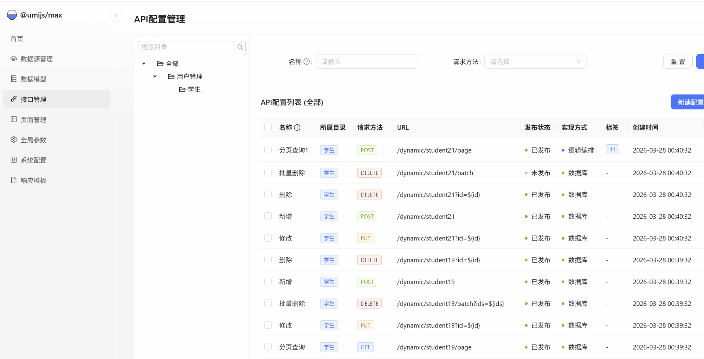

<div align="center">

# 🚀 Yu Flow - 轻量级动态 API 业务编排引擎

**让接口开发像“搭积木”一样简单！**

*拖拽节点 → 编排逻辑 → 一键发布 API，彻底告别重复的 CRUD 和繁琐的 BFF 层开发*

[](https://opensource.org/licenses/Apache-2.0)
[](https://spring.io/projects/spring-boot)
[](https://www.oracle.com/java/)
[](https://reactjs.org/)
[](https://github.com/wangxd-yu/yu-flow/pulls)

**[在线体验](#-在线体验-live-demo) · [为什么选择](#-为什么选择-yu-flow) · [核心特性](#-核心特性) · [快速开始](#-快速开始) · [技术架构](#-技术架构)**

<br/>

> **如果这个项目对您有帮助，请右上角点击 ⭐ Star 支持一下，这是我们持续开源的动力！**

</div>

---

## 🎯 在线体验 (Live Demo)

百闻不如一见，直接上手体验（这是最佳了解途径）：

- 🌐 **访问地址**：[http://39.97.234.83:11281/flow/flow-ui](http://39.97.234.83:11281/flow/flow-ui)
- 👤 **体验账号**：`admin`
- 🔑 **体验密码**：`123456`

*(注：演示环境为只读模式，已锁定核心资产并禁用高危操作。系统内置了 `✨ 官方演示案例` 目录，包含 JSON Mock、连库查询与流程编排三个典型 Demo，欢迎体验调用与“执行大盘”的轨迹回放！)*

---

<div align="center">
  
</div>

---

## 🤔 为什么选择 Yu Flow？

在日常开发中，我们常常遇到以下场景：前端急需一个静态的 Mock 数据进行联调；业务需要快速对外暴露一个单表查询接口；或者需要聚合多个底层服务的数据，还得做复杂的格式转换。

传统的开发模式意味着：建 Controller、写 Service、写 Mapper、联调、走流水线发版，漫长且痛苦。
**Yu Flow 旨在打破这一僵局**：我们提供了一种**层层递进的极简 API 构建方案**，满足从“一秒造假数据”到“复杂服务编排”的全场景需求，全程**在线配置，秒级生效**。

| 业务场景 | 传统开发模式 (耗时、费力) | 🚀 使用 Yu Flow (层层递进，敏捷高效) |
|------|:----------|:----------|
| **一秒 Mock / 应急静态数据** | 找后端手写临时 Controller，上线后还得记着删 | **【入门】JSON / 文本模式**：直接贴入 JSON 或字符串，即刻获得一个真实的 API，前端不再等排期。 |
| **单表/连表的快速 CRUD** | 搭建后台，写实体类、Mapper、XML、Service | **【进阶】DB 模式**：直接写 SQL 语句，一键暴露为 RESTful 接口，内置参数防注入与安全校验。 |
| **BFF 聚合与第三方系统对接** | 找后端排期，手写跨库 SQL、组装 DTO、重试逻辑 (2-5天) | **【终极】FLOW 画布模式**：拖拽式编排业务逻辑。内置 If/Switch 和多语言脚本沙箱，实现极致的接口动态化 (**30分钟**)。 |

---

## ✨ 核心特性

### 🎨 极致的可视化体验
基于 AntV X6 打造的丝滑画布引擎，拖拽式构建业务逻辑，所见即所得。自带完善的请求和响应实时预览。

### 📦 22 种开箱即用的硬核节点
涵盖了绝大部分业务场景，且支持扩展：
- **流程控制**：`Start` · `End` · `If` · `Switch` · `Condition` · `For` · `Collect` · `Parallel` · `Return`
- **数据处理**：`Evaluate` · `Template` · `SetVar` · `Record` · `SystemVar` · `SystemMethod`
- **外部交互**：`HttpRequest` · `Database` · `ServiceCall` · `ApiServiceCall`
- **请求响应**：`Request` · `Response`

### 🔥 强悍的「三引擎」脚本系统
满足不同开发者的编码习惯，内置安全沙箱防注入：
1. **AviatorScript** (默认)：极速、轻量，非常适合条件判断和简单表达式计算 (`price * 0.8`)。
2. **JavaScript (GraalJS)**：支持完整的 ES6+ 语法，前端同学的福音，轻松处理复杂 JSON 数据转换。
3. **SpEL (Spring Expression)**：完美契合 Spring 生态，无缝调用上下文中允许的 Bean。

### 🗄️ 动态多数据源与极简 SQL
支持运行时动态添加/切换数据源 (MySQL, PostgreSQL, 瀚高等)。只需一个 Database 节点，即可直接执行 SQL 并将结果注入流程上下文。

### 🔀 高性能 Scatter-Gather 并发模型
利用 `For` 节点自动将数组数据拆分到并发分支执行，再通过 `Collect` 节点进行屏障汇聚，原生支持高性能的并发数据批处理。

### 📡 企业级执行大盘与只读回放
内置 `flow_execution_log` 和 `FlowTrace` 模型，自动异步拦截并持久化 API 调用链路。生产环境报错？一键点击即可在画布上高保真回放事故现场（变量快照、节点耗时、成功/失败状态全景展示）。

### 🔌 极致的嵌入友好性
Yu Flow 被设计为一个极其轻量的组件。**只需引入一个 JAR 包**，你的任何 Spring Boot 业务系统就能瞬间拥有 API 动态编排能力，代码零侵入！

---

## 🚀 快速开始

### 准备工作
- Java 8+
- Node.js 18+ (如果需要本地编译前端)
- MySQL 5.7+ / 8.0+
- Redis 6.0+

### 1. 源码本地运行

```bash
# 1. 克隆仓库
git clone https://github.com/wangxd-yu/yu-flow.git
cd yu-flow

# 2. 启动后端 (准备好 MySQL 和 Redis)
cd flow-api
# 请先在 application.yml 中配置好您的数据库和 Redis 连接
mvn spring-boot:run

# 3. 启动前端控制台 (新开终端)
cd ../flow-ui
pnpm install
pnpm dev
```
打开浏览器访问 `http://localhost:8000` 即可开始编排！

### 2. 生产环境一键打包
Yu Flow 支持将前端产物内嵌至后端的 Fat JAR 中，实现极简部署。

```bash
# 执行打包脚本 (自动编译前端并打包进 Spring Boot)
bash 脚本/deploy_to_server.sh 
# 或者手动执行 mvn clean package -P ui
```

---

## 🏗️ 技术架构

```text
┌──────────────────────────────────────────────────────┐
│                    flow-ui (前端)                    │
│   React 18 · Ant Design Pro · AntV X6 · Amis · CR    │
└───────────────────────┬──────────────────────────────┘
                        │ REST API (JWT)
┌───────────────────────▼──────────────────────────────┐
│                    flow-api (后端)                   │
│              Spring Boot 2.7 · JPA · Redis           │
│  ┌────────────────────────────────────────────────┐  │
│  │              FlowEngine 核心引擎               │  │
│  │  ┌──────────┐ ┌──────────┐ ┌──────────┐        │  │
│  │  │ Aviator  │ │ GraalJS  │ │   SpEL   │        │  │
│  │  │ 编译缓存 │ │ AST缓存  │ │ 安全沙箱 │        │  │
│  │  └──────────┘ └──────────┘ └──────────┘        │  │
│  │  22种节点模型 · Scatter-Gather · 流程上下文校验│  │
│  └────────────────────────────────────────────────┘  │
│  动态数据源(Druid) · 接口限流 · 资产目录 · 登录审计   │
└──────────────────────────────────────────────────────┘
```

---

## 🗺️ 产品路线图 (Roadmap)

- [x] 核心编排引擎 (22种节点)
- [x] 多语言脚本引擎沙箱 (Aviator / GraalJS / SpEL)
- [x] 动态多数据源实时执行
- [x] 可视化流程编辑器
- [x] 演示模式安全防护
- [x] 全自动的一键打包与部署体系
- [x] 运行监控与调用链追踪大盘 (Trace 高保真回放)
- [x] 全息审计与日志自动清理 (数据治理)
- [ ] 流程单步断点调试器 (Breakpoint Debugging)
- [ ] 历史版本管理与无限回滚
- [ ] 插件化自定义节点市场

---

## 🤝 参与贡献

开源的本质在于共建，我们非常渴望并且欢迎您参与到 Yu Flow 的建设中来：

- 🐛 **发现 Bug？** → 欢迎提交 [Issue](https://github.com/wangxd-yu/yu-flow/issues)
- 💡 **有新想法/功能需求？** → 欢迎发起 [Discussion](https://github.com/wangxd-yu/yu-flow/discussions)
- 🔧 **想直接优化代码？** → Fork 本仓库，修改后提交 PR！

如果你觉得项目还不错，别忘了点亮右上角的 **Star** ⭐！你的支持是我们最大的动力！

## 💬 交流与支持

- **QQ / 邮箱**：657716219@qq.com

---

## 💼 商业版 (Yu Flow Pro)

针对企业级复杂场景，我们提供 **Yu Flow Pro** 增强版，包含更强悍的特性：

- 🏢 **多租户架构**：支持复杂的组织架构与数据隔离
- 🛡️ **高级 API 网关**：细粒度限流、熔断降级、多种鉴权方式
- 📊 **全局监控大盘**：接口调用量、延迟分析、错误率深度剖析
- 🔄 **灰度发布系统**：平滑升级，流量无缝切换
- 🔌 **企业级应用连接器**：开箱即用的钉钉、企微、飞书、SAP 等连接器
- 📞 **专属技术专家支持**

*如有企业级需求，欢迎联系：`657716219@qq.com` 咨询试用。*

---

## 📄 开源协议

本项目采用 [Apache License 2.0](LICENSE) 开源协议。完全允许商业使用、修改和分发，但请保留原作者版权信息。
