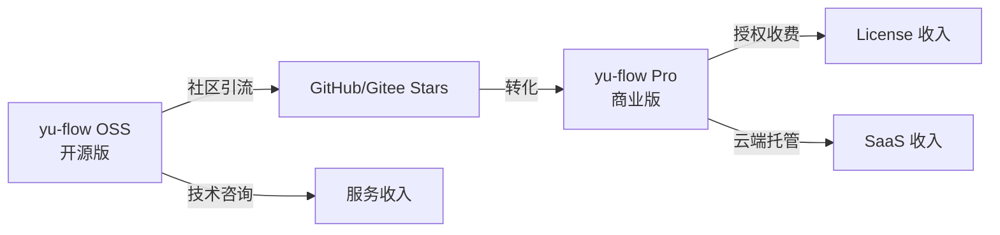
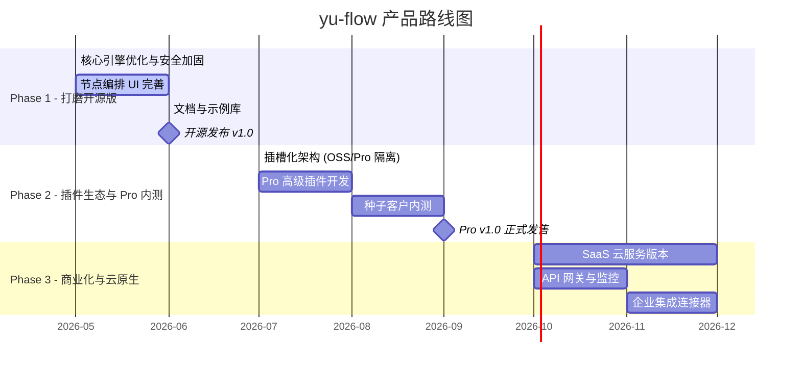
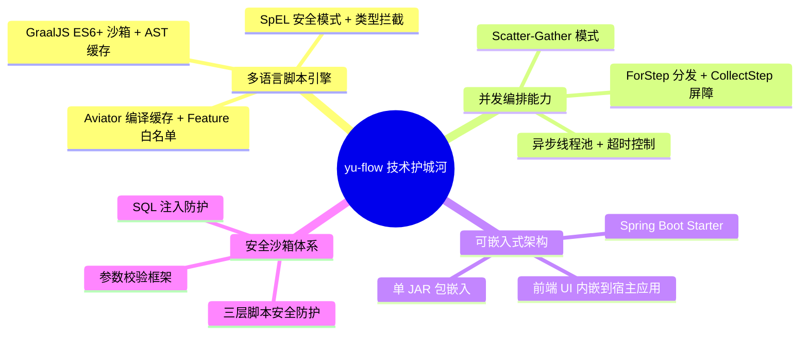

# yu-flow 动态 API 编排引擎 — 商业企划书

> **版本**: v1.0 · **日期**: 2026-05-12 · **作者**: yu-flow 团队

---

## 一、项目概述

### 1.1 产品定位

**yu-flow** 是一款轻量、高性能的**动态 API 业务编排引擎**。通过可视化画布拖拽 + 多语言脚本引擎，让开发者和业务人员无需硬编码即可快速构建、组合和发布 REST API 接口。

### 1.2 技术架构全景

```
┌─────────────────────────────────────────────────┐
│                   flow-ui (前端)                  │
│  React + Ant Design Pro + AntV X6 画布 + Amis    │
│  CodeMirror (JS/SQL/JSON 编辑) + DnD-Kit 拖拽    │
└──────────────────────┬──────────────────────────┘
                       │ REST API
┌──────────────────────▼──────────────────────────┐
│                  flow-api (后端)                  │
│            Spring Boot 2.7 + JPA + Redis         │
├──────────────────────────────────────────────────┤
│  ┌─────────────────────────────────────────────┐ │
│  │           FlowEngine 核心引擎                │ │
│  │  ┌───────────┬───────────┬───────────┐      │ │
│  │  │ Aviator   │ GraalJS   │   SpEL    │      │ │
│  │  │ (表达式)  │ (ES6脚本) │ (安全沙箱)│      │ │
│  │  └───────────┴───────────┴───────────┘      │ │
│  │  22种节点类型 · 并发Scatter-Gather · 宏系统  │ │
│  └─────────────────────────────────────────────┘ │
│  动态数据源(Druid) · JWT认证 · 目录管理 · 数据模型│
└──────────────────────────────────────────────────┘
```

### 1.3 已实现的核心能力

| 能力分类 | 已实现内容 |
|---------|-----------|
| **流程节点** (22种) | Start/End、Request/Response、Evaluate、If/Switch、For/Collect(并发Scatter-Gather)、HttpRequest、Database、ServiceCall、SystemMethod/SystemVar、Template、Record、Parallel、SetVar、Return |
| **多语言脚本引擎** | AviatorScript (默认,编译缓存+沙箱)、GraalJS (ES6+,AST缓存)、Spring SpEL (安全模式) |
| **动态数据源** | 多数据源管理 (MySQL/PostgreSQL/瀚高)、Druid 连接池、运行时热切换 |
| **API 管理** | CRUD 配置、URL/Method 绑定、发布状态管理、目录分类、标签体系、批量操作 |
| **安全体系** | JWT 登录认证、Aviator Feature 白名单沙箱、GraalJS IO/进程/线程全禁用、SpEL 类型引用拦截 |
| **系统宏** | 全局变量宏 + 函数宏、SpEL 编译缓存、SQL/JS 作用域隔离 |
| **前端 UI** | AntV X6 可视化画布、Amis 低代码页面、CodeMirror 代码编辑、Pro Components 管理后台 |
| **数据模型** | 可视化数据建模、字段管理、模型与 API 联动 |

---

## 二、市场分析与商业价值

### 2.1 目标市场痛点

| 痛点 | 传统方式 | yu-flow 方案 |
|------|---------|-------------|
| **接口开发周期长** | 每个 API 需编码→测试→部署，平均 2-5 天 | 拖拽编排 + 即时发布，**30 分钟**上线一个 API |
| **BFF 聚合层维护难** | 前端每次需求变更都需后端改 BFF 接口 | 前端/业务人员自助编排，**后端零介入** |
| **多数据源整合复杂** | 需手写代码管理多个数据库连接和 SQL | 可视化配置数据源 + Database 节点一键调用 |
| **业务逻辑散落各处** | 逻辑分散在微服务中，难以复用和管控 | 统一编排引擎，**API 资产化管理** |
| **安全风险不可控** | 用户脚本可能执行危险操作 | 三层沙箱 (Aviator Feature白名单 + GraalJS IO禁用 + SpEL 类型拦截) |

### 2.2 竞品对比

| 维度 | yu-flow | Apifox/Postman | Node-RED | 国产低代码平台 |
|------|---------|----------------|----------|-------------|
| **核心定位** | API 编排引擎 | API 测试工具 | IoT 流程编排 | 通用应用搭建 |
| **部署模式** | 私有化/嵌入式 | SaaS | 私有化 | SaaS/私有化 |
| **脚本能力** | Aviator+JS+SpEL | JS 脚本 | JS (Node.js) | 弱/无 |
| **并发处理** | Scatter-Gather 原生支持 | 无 | 有限 | 无 |
| **数据库直连** | ✅ 多数据源 | ❌ | 插件支持 | 部分支持 |
| **可嵌入性** | ✅ JAR 包嵌入 | ❌ | ❌ | ❌ |
| **开源** | ✅ | ❌ | ✅ | 部分 |

### 2.3 目标客户画像

1. **中小型互联网公司** — 快速搭建 BFF 层，减少后端接口开发工作量
2. **传统企业数字化转型** — 对接多个异构系统 (ERP/CRM/OA)，统一 API 出口
3. **ISV/SaaS 厂商** — 将 yu-flow 引擎嵌入自有产品，提供用户自定义 API 能力
4. **政府/国企信创项目** — 支持瀚高/PostgreSQL 国产数据库，满足信创要求

---

## 三、商业模式与变现策略

### 3.1 Open Core 双版本策略



### 3.2 版本功能对比

| 功能 | 开源版 (OSS) | 商业版 (Pro) |
|------|:-----------:|:-----------:|
| 核心编排引擎 (22种节点) | ✅ | ✅ |
| 多语言脚本 (Aviator/JS/SpEL) | ✅ | ✅ |
| 可视化画布编辑器 | ✅ | ✅ |
| 动态数据源管理 | ✅ | ✅ |
| API 发布与管理 | ✅ | ✅ |
| 系统宏管理 | ✅ | ✅ |
| **多租户权限体系** | ❌ | ✅ |
| **API 网关 (限流/熔断/鉴权)** | ❌ | ✅ |
| **版本管理与灰度发布** | ❌ | ✅ |
| **流程调试器 (断点/单步)** | ❌ | ✅ |
| **审批流 (API 上线审批)** | ❌ | ✅ |
| **监控仪表盘 (调用量/延迟/错误率)** | ❌ | ✅ |
| **企业集成连接器 (钉钉/企微/飞书)** | ❌ | ✅ |
| **分布式集群部署** | ❌ | ✅ |
| **链路追踪 (SkyWalking)** | ❌ | ✅ |
| **商业技术支持** | ❌ | ✅ |

### 3.3 定价策略

| 版本 | 价格 | 适用场景 |
|------|------|---------|
| **OSS 开源版** | 免费 | 个人开发者、学习研究、小型项目 |
| **Pro 标准版** | ¥9,800/年/实例 | 中小企业，单体部署，≤10 个数据源 |
| **Pro 企业版** | ¥39,800/年/集群 | 中大型企业，集群部署，不限数据源 |
| **OEM 嵌入式授权** | 面议 | ISV 将引擎嵌入自有产品 |
| **定制化实施服务** | ¥2,000/人天 | 驻场实施、定制开发、培训 |

### 3.4 收入预测 (保守估计)

| 阶段 | 时间线 | 预计收入 (年) | 收入构成 |
|------|--------|-------------|---------|
| 种子期 | 0-6 个月 | ¥0 | 开源推广,积累用户 |
| 起步期 | 6-12 个月 | ¥30-50 万 | 3-5 家 Pro 标准版客户 + 技术咨询 |
| 成长期 | 12-24 个月 | ¥100-300 万 | 10+ Pro 客户 + 2-3 家企业版 + OEM |
| 规模期 | 24-36 个月 | ¥500-1000 万 | 规模化销售 + SaaS 云服务 |

---

## 四、产品演进路线图

### 4.1 总体规划



### 4.2 Phase 1: 打磨开源版 (30天迭代计划)

#### Sprint 1: 核心引擎加固 (Day 1-10)

| 日期 | 任务 | 产出 |
|------|------|------|
| **Day 1-2** | ✅ 重构 Aviator/GraalJS 引擎：编译缓存 + Feature 白名单沙箱 + AST 缓存优化 | 已完成 |
| **Day 3-4** | 前端画布 UI 优化：节点拖拽体验、连线逻辑、属性配置面板交互 | 改进的 X6 画布 |
| **Day 5-6** | 动态数据源管理联调：多环境切换、连接测试、SQL 预览 | 完善的数据源模块 |
| **Day 7-8** | 全链路日志 + 可视化调试：节点执行日志收集、数据快照查看 | 调试面板 MVP |
| **Day 9-10** | 集成测试 + P0/P1 Bug 修复 + 核心 API 冻结 | 稳定的 v1.0-RC |

#### Sprint 2: 插件机制与生态 (Day 11-20)

| 日期 | 任务 | 产出 |
|------|------|------|
| **Day 11-12** | 规范化 FeatureTrait 插件开发标准，编写标准插件示例 | 插件开发规范文档 |
| **Day 13-14** | 实现常用节点增强：ForEach 串行循环优化、数据转换节点 | 增强的节点库 |
| **Day 15-17** | 搭建 OSS/Pro 代码同步策略 + Pro Slot 注入机制脚手架 | 双版本架构基础 |
| **Day 18-20** | 编写核心架构文档、开发者指南 (如何开发自定义节点) | 开发者文档 |

#### Sprint 3: 开源发布准备 (Day 21-30)

| 日期 | 任务 | 产出 |
|------|------|------|
| **Day 21-22** | 准备 3-5 个典型 Demo 场景 (聚合查询/Webhook/数据ETL) | Demo 示例库 |
| **Day 23-24** | 完善 README + 产品宣传素材 + Docker Compose 一键部署 | 发布物料 |
| **Day 25-26** | 官网搭建 (VitePress) + 在线 Demo 环境部署 | 官网上线 |
| **Day 27-28** | 撰写技术软文 + 准备社区推广渠道 (掘金/OSChina/V2EX) | 推广内容 |
| **Day 29** | 最终回归测试 + 代码合并 main + 打 Tag v1.0.0-OSS | Release 包 |
| **Day 30** | 🎉 **正式开源发布！** 全渠道推广 + 收集用户反馈 | 开源上线 |

---

## 五、技术护城河

### 5.1 核心技术壁垒



### 5.2 vs 自研成本对比

| 如果企业自研 | 预计投入 | yu-flow 替代 |
|------------|---------|-------------|
| 编排引擎设计与开发 | 3 人 × 3 月 = 9 人月 | ✅ 开箱即用 |
| 多语言脚本沙箱 | 2 人 × 2 月 = 4 人月 | ✅ 已内置 |
| 可视化画布编辑器 | 2 人 × 3 月 = 6 人月 | ✅ 已内置 |
| 动态数据源管理 | 1 人 × 1 月 = 1 人月 | ✅ 已内置 |
| 测试与稳定性打磨 | 2 人 × 2 月 = 4 人月 | ✅ 社区验证 |
| **合计** | **≈ 24 人月 ≈ ¥60-80万** | **¥0 (OSS) / ¥9,800 (Pro)** |

---

## 六、推广策略

### 6.1 社区运营计划

| 渠道 | 策略 | 目标 |
|------|------|------|
| **GitHub / Gitee** | 开源主阵地，维护 README、Issues、Wiki | 6个月 1000+ Stars |
| **掘金 / OSChina** | 技术深度文章系列 (架构解析/实战教程) | 每篇 500+ 阅读 |
| **B站 / 微信视频号** | 产品演示视频、使用教程 | 吸引非技术用户 |
| **微信群 / Discord** | 用户社区运营、需求收集 | 300+ 活跃开发者 |
| **技术大会** | 线下分享 (QCon/ArchSummit/GIAC) | 品牌曝光 |

### 6.2 内容营销矩阵

1. **《为什么你需要动态 API 编排》** — 痛点引发共鸣
2. **《yu-flow 架构解析：如何设计一个安全的多语言脚本沙箱》** — 技术深度吸引开发者
3. **《30 分钟用 yu-flow 搭建微信小程序 BFF》** — 实战教程降低门槛
4. **《从 0 到 1：yu-flow 如何为中小企业节省 80 万研发成本》** — 商业价值打动决策者
5. **《yu-flow vs Node-RED：API 编排引擎的正确选择》** — 竞品对比建立心智

---

## 七、团队与里程碑

### 7.1 关键里程碑

| 时间 | 里程碑 | 关键指标 |
|------|--------|---------|
| 2026 Q2 | OSS v1.0 开源发布 | GitHub 500+ Stars |
| 2026 Q3 | Pro v1.0 内测发售 | 3 家种子客户 |
| 2026 Q4 | Pro v1.0 正式发售 + SaaS 上线 | 10+ 付费客户, ARR ¥50万+ |
| 2027 Q1 | 企业版发布 + OEM 授权 | ARR ¥150万+ |
| 2027 Q2 | A 轮融资 / 盈亏平衡 | ARR ¥300万+ |

### 7.2 风险与应对

| 风险 | 等级 | 应对策略 |
|------|------|---------|
| 开源社区增长缓慢 | 中 | 投入更多内容营销 + 参加技术大会 |
| 大厂推出竞品 | 高 | 深耕垂直场景 + 差异化 (可嵌入/信创) |
| 安全漏洞 | 高 | 持续安全审计 + 三层沙箱 + 漏洞响应机制 |
| 商业转化率低 | 中 | 提供更多企业级独占特性 + 免费试用期 |

---

## 八、总结

**yu-flow** 的核心竞争力在于：

1. **真正的编排引擎** — 不是简单的 API 网关或表单生成器，而是具备完整控制流 (条件/循环/并发) 的业务逻辑编排引擎
2. **三引擎脚本沙箱** — Aviator + GraalJS + SpEL 三引擎覆盖从简单表达式到复杂 ES6 脚本的全场景需求
3. **可嵌入式架构** — 单 JAR 包即可嵌入任何 Spring Boot 应用，ISV 友好
4. **信创兼容** — 原生支持瀚高/PostgreSQL 国产数据库

通过 **Open Core** 模式，以开源社区引流，以商业版变现，以 SaaS 规模化，预计 **18-24 个月**实现盈亏平衡。

---

*本文档基于 yu-flow 代码仓库实际分析生成，所有技术能力描述均有代码实现支撑。*
